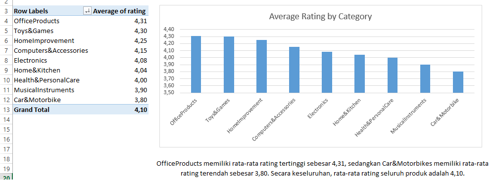
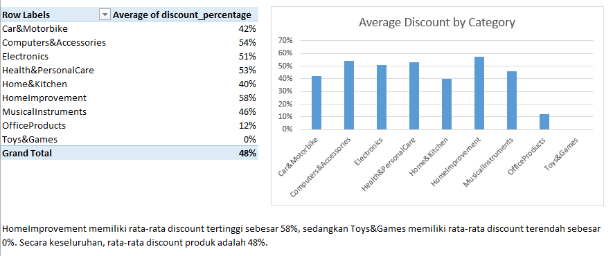
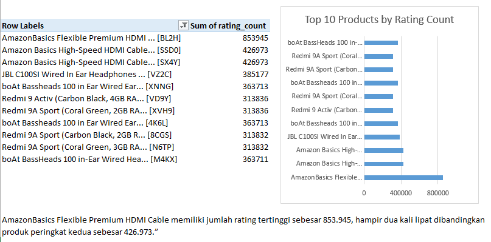
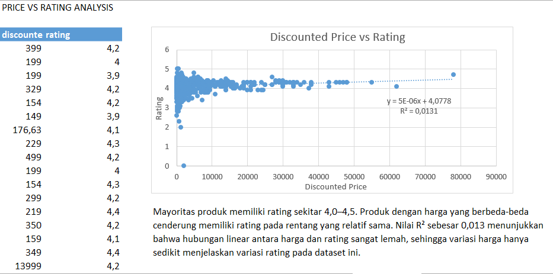

# Amazon Sales Data Analysis

## Project Overview

Analisis dataset Amazon Sales untuk mengidentifikasi pola rating produk,
discount, popularitas produk, serta hubungan antara harga dan rating.

## Dataset

Dataset berasal dari Kaggle.

- Jumlah data: 1,465 rows
- Sumber: Kaggle – Amazon Sales Dataset

[Kaggle Dataset](https://www.kaggle.com/datasets/karkavelrajaj/amazon-sales-dataset/data)

## Objective

- Menganalisis rata-rata rating berdasarkan kategori
- Menganalisis rata-rata discount berdasarkan kategori
- Mengidentifikasi produk dengan rating count tertinggi
- Menganalisis hubungan harga dengan rating

## Data Cleaning

Proses cleaning meliputi:

- Membersihkan format harga
- Mengubah rating menjadi numeric
- Membersihkan rating_count
- Menangani format discount
- Membuat Category_main
- Membuat product_name_short
- Validasi tipe data

## Tools

- Microsoft Excel
- PivotTable
- PivotChart
- Excel Formulas
- Scatter Plot
- Trendline

## Analysis & Findings

### 1. Rating by Category

OfficeProducts memiliki rata-rata rating tertinggi sebesar 4,31,
sedangkan Car&Motorbike memiliki rata-rata rating terendah sebesar 3,80.

Overall average rating adalah 4,10.

### 2. Discount by Category

HomeImprovement memiliki rata-rata discount tertinggi sebesar 58%,
sedangkan Toys&Games memiliki rata-rata discount terendah sebesar 0%.

Overall average discount adalah 48%.

### 3. Top Products by Rating Count

AmazonBasics Flexible Premium HDMI Cable memiliki jumlah rating
tertinggi sebesar 853.945, hampir dua kali lipat dibandingkan produk
peringkat kedua sebesar 426.973.

### 4. Price vs Rating

Mayoritas produk memiliki rating sekitar 4,0–4,5.

Produk dengan harga yang berbeda-beda cenderung memiliki rating
pada rentang yang relatif sama.

Nilai R² sebesar 0,013 menunjukkan hubungan linear antara harga
dan rating sangat lemah.

## Dashboard

## Limitations

- Dataset berasal dari pihak ketiga/Kaggle.
- Analisis bersifat deskriptif.
- Tidak terdapat informasi penjualan aktual.
- Rating tidak dapat digunakan sebagai satu-satunya indikator
  keberhasilan produk.